<div align="center">

# 🪔 Hissa · हिस्सा

### Back the street stalls you love. Grow with them.

*Hissa means "share". Rate Bengaluru's street food, find hidden stalls, and back the vendors you love.<br>When their stall grows, you get a share of it, plus treats at their counter.*

<br>

[](https://hissa-1w52.vercel.app)


<br>

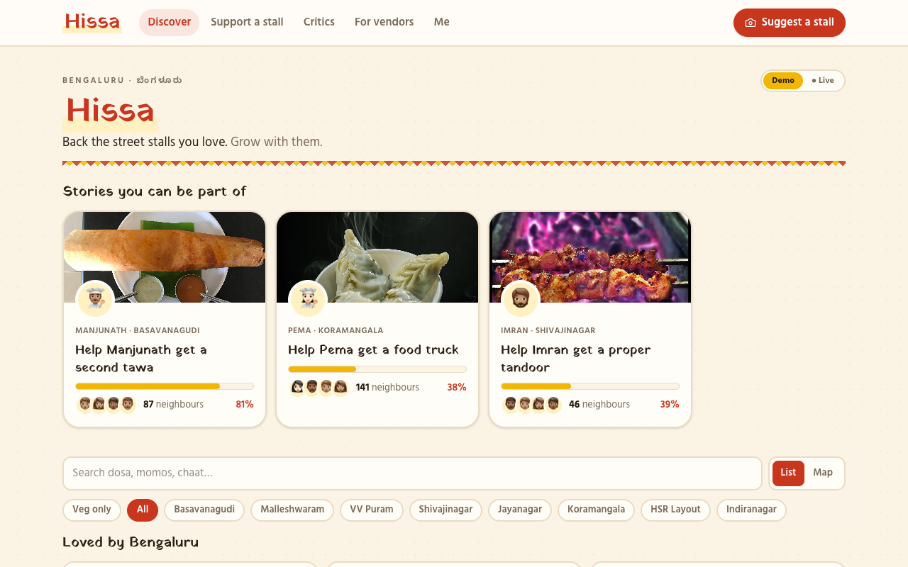

</div>

---

## 🌶️ The idea in 30 seconds

Every Bengaluru regular has *that* stall: the benne dosa cart with a 20-minute queue, the chaat corner on Food Street, the momo lady who ran out by 8 PM. **The food is great, but the vendor can't grow.** A second tawa, a covered counter or a food truck costs ₹30,000 to ₹2,50,000, and banks don't lend to carts.

**Hissa connects the two:**

| | |
|---|---|
| 🧑‍🍳 **Vendors** | Post a small growth goal: *"Help Manjunath get a second tawa"* |
| 🤝 **Neighbours** | Chip in from ₹500 |
| 🎁 **Milestones** | Each one unlocks **food-credit treats** for every backer |
| 🌱 **Growth** | Backers get a **share of the extra sales** until they've received up to 1.5× back |
| ⭐ **Critics** | Rate stalls, find unlisted ones, and climb the leaderboard |

> **No dataset lists Bengaluru's street stalls.** The best carts are invisible online. Hissa's critics build the map that doesn't exist yet.

---

## 🧭 How it works

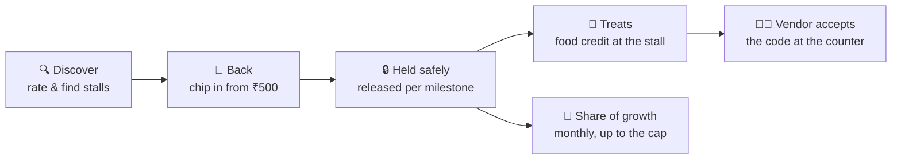

### 1 · Discover stalls worth backing

Stories from vendors come first, then Bengaluru's best-rated stalls, then **1,280+ real food spots pulled live from OpenStreetMap** that nobody on Hissa has tasted yet.

<p align="center">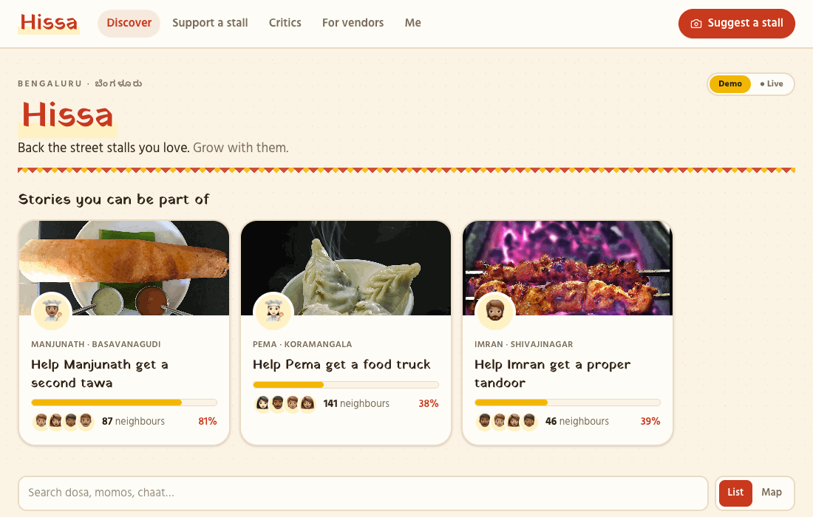</p>

### 2 · Back a vendor's next step

Every campaign shows the vendor's own words, updates, a milestone journey, and **why neighbours believe in it**: rating trends, what reviews keep mentioning, and honest risks. Pick an amount and you're part of the story.

<p align="center">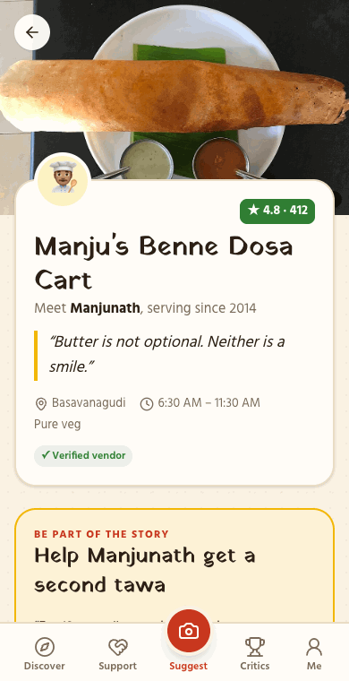</p>

### 3 · Snap a stall to put it on the map

Found a cart nobody knows about? Snap its menu board. The AI reads the dishes and prices, including handwritten Kannada boards, and fills in the listing. Three critics vouch, and it goes live with your name on it.

<p align="center">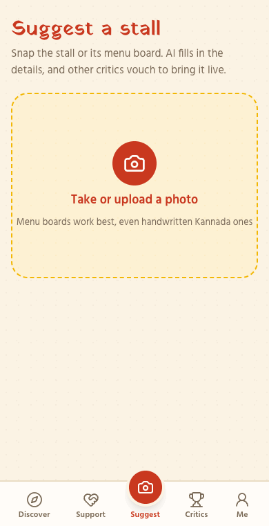</p>

<sub>The GIF shows the built-in demo result. Add an <code>ANTHROPIC_API_KEY</code> and Claude reads your actual photo.</sub>

### 4 · Treats at the counter

Milestones turn into food credit at that stall. Tap **Redeem** to get a 6-digit code, show it at the counter, and the vendor accepts it. The credit is only spent once the vendor accepts it.

<table align="center">
<tr>
<th>👤 Customer gets a code</th>
<th>🧑‍🍳 Vendor accepts it</th>
</tr>
<tr>
<td>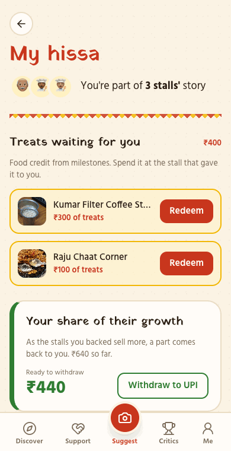</td>
<td>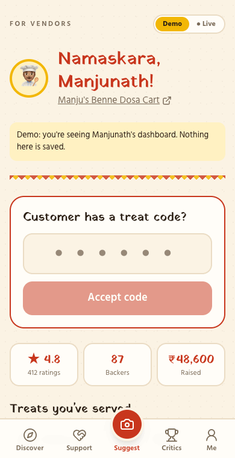</td>
</tr>
</table>

---

## 💸 How the money works

A worked example: **you back Manjunath's ₹60,000 second-tawa campaign with ₹1,000.**

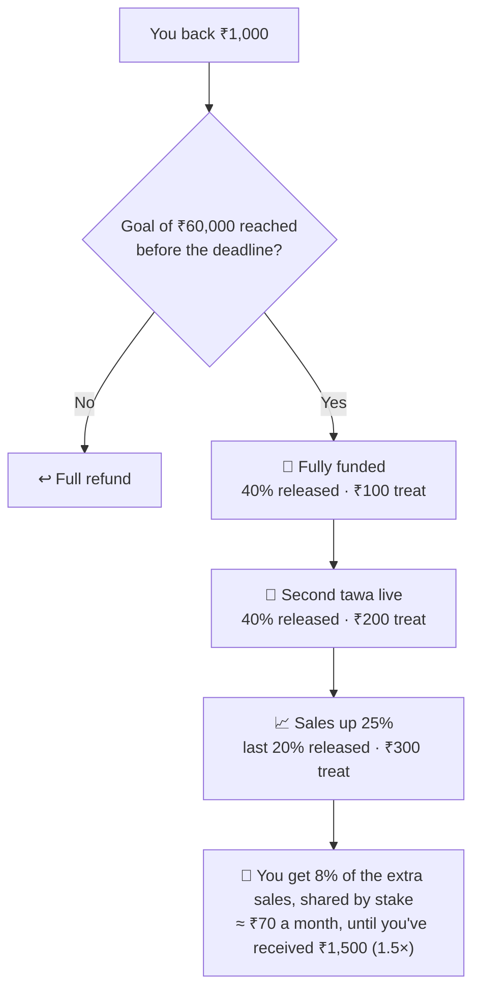

| Concern | How Hissa handles it |
|---|---|
| *"Will they run off with the money?"* | Money is held and released **only as milestones are verified** |
| *"What if the goal isn't met?"* | **Full refund** |
| *"Is the revenue reported honestly?"* | Backers share only in sales **growth above a baseline**, so there's less reason to misreport |
| *"Is ₹500 even worth it?"* | **Treats at every milestone**, so you always get something back |
| *"How do I pick a stall?"* | Rating trends, review signals and critics' taste scores on every campaign |

> 🧪 **Hissa is a hackathon prototype. All money is play money.** New players get ₹10,000 to back stalls with, and a *"Simulate a month of sales"* button shows revenue share arriving.

---

## 🧑‍🍳 For vendors

Vendors sign in like everyone else and **claim their stall** (or add a new one). Their dashboard has everything for running the stall on Hissa:

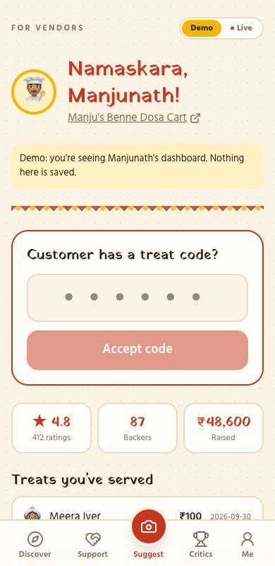

- 🔢 **Accept treat codes** at the counter in one tap
- 📣 **Start a growth campaign**: goal from cost items, duration, revenue share and payback cap, with a live preview of what backers get
- 💬 **Post updates** that appear on the stall page (*"Tawa ordered! Arrives Friday 🔥"*)
- 👥 **See who backed you** and the treats you've served
- ⭐ Rating, backers and amount raised at a glance

<br clear="right">

---

## 📱 Phones and laptops

Bottom tabs and swipeable stories on phones. On laptops, a top bar, 3-column grids, and a campaign column that stays in view next to the vendor's story.

<table align="center">
<tr>
<td>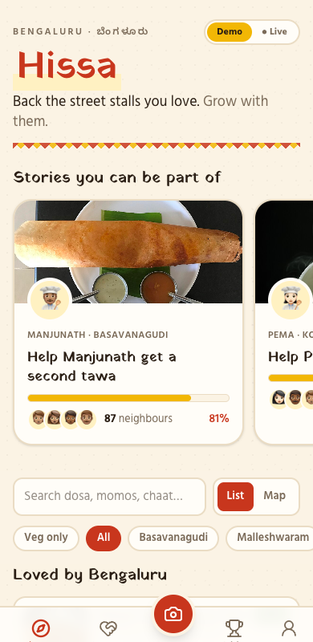</td>
<td>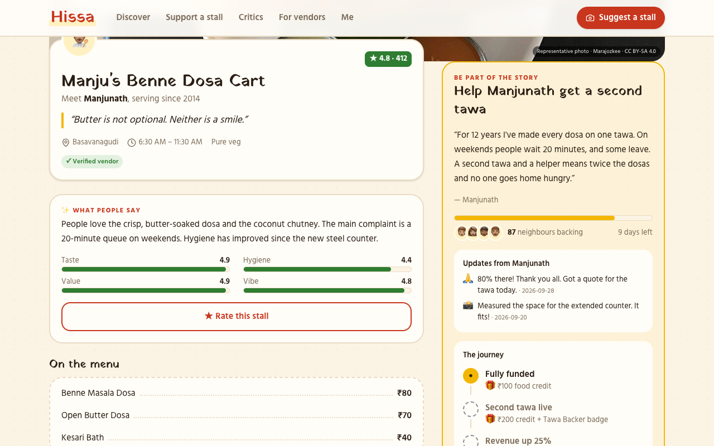</td>
</tr>
</table>

---

## 🎛️ Demo mode and Live mode

A **Demo / ● Live** switch sits on the home and profile screens.

| | 🎬 **Demo** | ● **Live** |
|---|---|---|
| Data | A hand-made sample Bengaluru | Real players in Supabase |
| Sign-in | Not needed | Email and password, with forgot-password |
| Money | Nothing is saved | ₹10,000 of play money per player |
| Best for | Showing the idea in 60 seconds | Letting friends actually play |

**A 60-second tour of the [live site](https://hissa-1w52.vercel.app):**
1. **Me → Sign up**, choose a face, and get ₹10,000 of play money
2. Open **Gowda's Ragi Mudde Stall** and **vouch**. Yours is the third vouch, so it goes live 🎉
3. **Back** a stall, then **rate** one
4. **For vendors → claim a stall** in a second browser, and accept a treat code from the first

---

## 🏗️ Under the hood

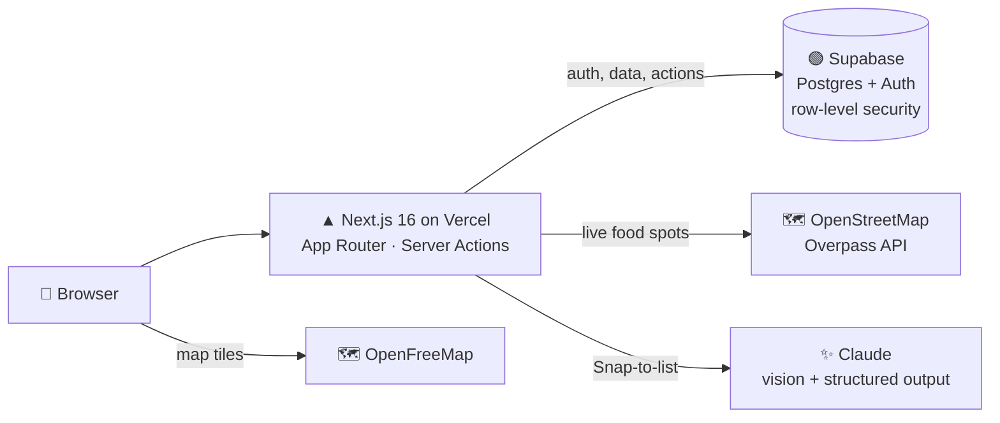

| Layer | What it uses |
|---|---|
| **App** | Next.js 16 (App Router, Server Components, Server Actions), React 19, TypeScript |
| **Design** | Tailwind CSS v4 · Yatra One (signboard headings) and Hind (body) · a turmeric, chilli and curry-leaf palette |
| **Data** | Supabase Postgres and Auth. Every write goes through a `security definer` function that checks the rules (balance, deadlines, caps, ownership), and row-level security blocks direct writes |
| **Maps** | Leaflet with the OpenFreeMap "Liberty" style via MapLibre (no API key) · live spots from the OpenStreetMap Overpass API, cached for a day |
| **AI** | Claude vision with structured output for Snap-to-list (optional; there's a demo result without a key) |
| **Photos** | Hand-picked, freely licensed dish photos from Wikimedia Commons, always labelled *"Representative photo"* |

<details>
<summary><b>📁 Project structure</b></summary>

```
src/
├─ app/                    Pages (Discover, stall, Support, Critics, Me, wallet, vendor…)
│  ├─ actions.ts           Server Actions: auth, backing, rating, vouching, vendor tools
│  └─ api/snap/            Snap-to-list endpoint (Claude vision)
├─ components/             UI pieces (StallCard, BackSheet, WalletView, vendor/…)
└─ lib/
   ├─ data/                One data layer, two sources: demo.ts (mock) and live.ts (Supabase)
   ├─ mock-data.ts         The demo world: stalls, campaigns, critics
   ├─ osm.ts               Live OpenStreetMap spots
   └─ dish-photos.ts       Photo credits and licences
supabase/
├─ migrations/             0001 core schema · 0002 vendor side
└─ seed.sql                Live mode's starting stalls (generated from the demo data)
```
</details>

<details>
<summary><b>🔐 Why players can't cheat the money</b></summary>

- Players can **read** only their own wallet. They can't insert, edit or delete anything directly.
- Every action is a Postgres function that checks the rules first:
  - `back_campaign`: enough play money, campaign still open, amount within limits
  - `withdraw_earnings` and `redeem_credit`: never more than the balance
  - `simulate_month`: never beyond each backing's 1.5× cap
  - `accept_redeem_code`: only the owner of *that* stall, only unexpired and unused codes
  - `vouch_stall`: one vouch per player, and the stall goes live at 3
- Players can't edit their own taste score or badges.

These rules are covered by 57 automated database checks (row-level security, limits, caps, codes, vouching).
</details>

---

## 🚀 Run it yourself

```bash
git clone https://github.com/Pratyush1427/Hissa.git
cd Hissa
npm install
cp .env.example .env.local
npm run dev            # → http://localhost:3000 (Demo mode works with no setup)
```

<details>
<summary><b>● Turn on Live mode (Supabase, free tier, about 5 minutes)</b></summary>

1. Create a project at [supabase.com](https://supabase.com) (region: Mumbai).
2. **Authentication → Sign In / Providers → Email**: switch **off** "Confirm email" so players can start instantly.
3. **SQL Editor**: run, in order:
   1. [`supabase/migrations/0001_hissa.sql`](supabase/migrations/0001_hissa.sql)
   2. [`supabase/seed.sql`](supabase/seed.sql)
   3. [`supabase/migrations/0002_vendors.sql`](supabase/migrations/0002_vendors.sql)
4. **Project Settings → API**: put the Project URL and the **publishable** key in `.env.local`:
   ```
   NEXT_PUBLIC_SUPABASE_URL=https://xxxx.supabase.co
   NEXT_PUBLIC_SUPABASE_PUBLISHABLE_KEY=sb_publishable_...
   ```
5. Restart `npm run dev`. The **● Live** switch appears.

To regenerate the seed from the demo data, run `node scripts/gen-seed.mts`.
</details>

<details>
<summary><b>▲ Deploy to Vercel</b></summary>

1. Import the repo at [vercel.com/new](https://vercel.com/new).
2. Add the two `NEXT_PUBLIC_SUPABASE_*` environment variables.
3. In Supabase → **Authentication → URL Configuration**, set the Site URL to your Vercel address and add `https://<your-app>.vercel.app/**` to the redirect URLs, so password-reset links work.

The map needs no key, and every push to `main` redeploys automatically.
</details>

<details>
<summary><b>✨ Real Snap-to-list with Claude (optional)</b></summary>

Add `ANTHROPIC_API_KEY=sk-ant-...` to `.env.local` (or to Vercel's environment variables). Each photo costs roughly ₹3–4. Without a key, Snap-to-list returns a clearly labelled demo result.
</details>

---

## 🛣️ What's next

- [ ] Real stall photos uploaded by critics and vendors
- [ ] Monthly sales reported by vendors (via UPI data) instead of *"simulate a month"*
- [ ] AI backer insight cards, review summaries and a food-concierge chat
- [ ] Phone (OTP) sign-in and a Kannada interface for vendors
- [ ] Selling your hissa to another backer (early exit)

---

## 🙏 Credits

- **Food spots and map data**: © [OpenStreetMap](https://www.openstreetmap.org/copyright) contributors (ODbL), tiles by [OpenFreeMap](https://openfreemap.org) / [OpenMapTiles](https://openmaptiles.org)
- **Dish photos**: freely licensed images from [Wikimedia Commons](https://commons.wikimedia.org). Each author and licence is listed in [`src/lib/dish-photos.ts`](src/lib/dish-photos.ts) and shown in the app
- **Photo in the Snap-to-list GIF**: [*Dry Gobi Manchurians*](https://commons.wikimedia.org/wiki/File:Dry_Gobi_Manchurians.JPG) by Dharmadhyaksha, CC BY-SA 4.0
- **Fonts**: [Yatra One](https://fonts.google.com/specimen/Yatra+One) and [Hind](https://fonts.google.com/specimen/Hind) via Google Fonts · icons by [Lucide](https://lucide.dev)
- The stalls, vendors and critics in Demo mode are **fictional**, set in real Bengaluru neighbourhoods

<div align="center">
<br>

**Made with 🌶️ in Bengaluru**

</div>
